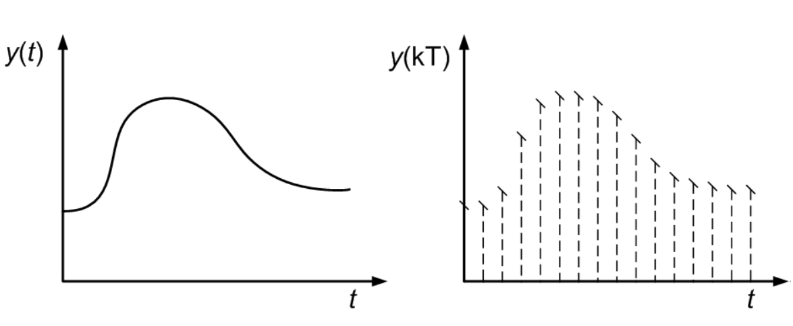

# Projeto da Maratona de Filmes:
## Feito por: Rodrigo Nigri Griner
## (Para visualizar o arquivo em Markdown, pressione Ctrl+Shift+V no Vscode)

# Problema:
Você quer passar um dia do final de semana assistindo ao máximo de filmes possível, mas há restrições quanto aos horários disponíveis e ao número de títulos que podem ser vistos em cada categoria (comédia, drama, ação, etc).

Entrada: Um inteiro N representando o número de filmes disponíveis para assistir e N trios de inteiros `(H[i], F[i], C[i])`, representando a hora de início, a hora de fim e a categoria do i-ésimo filme. Além disso, um inteiro M representando o número de categorias e uma lista de M inteiros representando o número máximo de filmes que podem ser assistidos em cada categoria.

Saída: Um inteiro representando o número máximo de filmes que podem ser assistidos de acordo com as restrições de horários e número máximo por categoria.

# Objetivo:
O objetivo do projeto é criar diversas estratégias de resolver o problema da maratona de filmes, para retornar o número máximo de filmes que podem ser assistidos de acordo com as restrições de horários e número máximo por categoria.

# Problema Discreto vs Problema Contínuo:
Se o nosso problema fosse contínuo, seria mais fácil de resolver, pois utilizando cálculo e derivadas, poderíamos encontrar o valor máximo da função objetivo. Porém, como o nosso problema é discreto, não sabemos os vizinhos de um ponto, e por isso, não é possível derivar a função para encontrar o valor máximo. Por isso, utilizaremos heurísticas e paralelizações para tentar encontrar esse valor máximo.




# PARTE 1: Implementação das Heurísticas:
## Heurística Gulosa:

### Pseudocódigo:
```
1. Organizar os filmes em um vetor de filmes (struct Filme: HoraInicio, HoraFim, Categoria)
2. Organizar as categorias em um vetor de categorias
3. Organizar os filmes em ordem crescente de HoraFim
4. Inicializar um vetor cronograma de filmes assistidos
5. Inicializar um vetor de categorias assistidas
6. Inicializar um inteiro com o número de filmes assistidos
7. Para cada filme do vetor de filmes:
    verifica se o filme está dentro do horário e se a categoria ainda não ultrapassou o limite
    adiciona o filme no vetor cronograma de filmes assistidos
    acrescenta a categoria no vetor de categorias assistidas
    incrementa o número de filmes assistidos
    atualiza o horário
8. Retorna o número de filmes assistidos
```	

### Código Comentado:

``` c++

// importando bibliotecas
#include<iostream>
#include<vector>
#include<algorithm>
#include <random>
#include <stdlib.h>
#include <fstream>

#define RESET   "\033[0m"
#define BLACK   "\033[30m"      /* Black */
#define RED     "\033[31m"      /* Red */
#define GREEN   "\033[32m"      /* Green */
#define YELLOW  "\033[33m"      /* Yellow */
#define BLUE    "\033[34m"      /* Blue */
#define MAGENTA "\033[35m"      /* Magenta */
#define CYAN    "\033[36m"      /* Cyan */
#define WHITE   "\033[37m"      /* White */
#define BOLDBLACK   "\033[1m\033[30m"      /* Bold Black */
#define BOLDRED     "\033[1m\033[31m"      /* Bold Red */
#define BOLDGREEN   "\033[1m\033[32m"      /* Bold Green */
#define BOLDYELLOW  "\033[1m\033[33m"      /* Bold Yellow */
#define BOLDBLUE    "\033[1m\033[34m"      /* Bold Blue */
#define BOLDMAGENTA "\033[1m\033[35m"      /* Bold Magenta */
#define BOLDCYAN    "\033[1m\033[36m"      /* Bold Cyan */
#define BOLDWHITE   "\033[1m\033[37m"      /* Bold White */

using namespace std;

struct filme {
    int id;
    int inicio;
    int fim;
    int categoria;
};

// função de comparação para ordenar os filmes pelo fim
bool my_compare(filme a, filme b){
    return a.fim < b.fim; // ordenando pelo mais leve
}

// função que cria o arquivo de saída
void createOutput(int numero_filmes, int tempo_de_tela){
    ofstream output;
    output.open("output_gulosa.txt", std::ios_base::app);
    output << numero_filmes << " " << tempo_de_tela << " " << (double)tempo_de_tela/numero_filmes << endl;
    output.close();
}

int main(){
    int numero_filmes;
    int numero_categorias;
    vector<filme> filmes; // vetor que armazena todos os filmes
    vector<filme> cronograma; // vetor que armazena os filmes que serao vistos no dia
    vector<int> maximo_categorias; // vetor que diz quantos filmes por categoria {'0',3,7,5,2}


    cin >> numero_filmes >> numero_categorias;

    // lendo as categorias
    maximo_categorias.push_back(0);

    int max;
    for(int i = 0; i < numero_categorias; i++){
        cin >> max;
        maximo_categorias.push_back(max);

    }

    // lendo os filmes
    int hora_inicio, hora_fim, cat;
    for(int i = 0; i < numero_filmes; i++){
        cin >> hora_inicio;
        cin >> hora_fim;
        cin >> cat;

        if(hora_fim == 0){
            hora_fim = 24;
        }

        if(hora_fim > hora_inicio){
            filmes.push_back({i, hora_inicio,hora_fim, cat});
        }
        

    }

    // ordenando os filmes pelo fim
    sort(filmes.begin(), filmes.end(), my_compare);

    int hora_atual = 0;
    for(auto& this_film : filmes){
        
        // se o filme estiver dentro do horario e a categoria ainda nao tiver sido assistida o filme entra no cronograma
        if(hora_atual <= this_film.inicio && maximo_categorias[this_film.categoria] > 0){
            cronograma.push_back(this_film);
            hora_atual = this_film.fim;
            maximo_categorias[this_film.categoria] -= 1;

        }

    }

    // criando o arquivo de saida
    int numero_filmes_vistos = 0;
    int tempo_de_tela = 0;
    for(auto& this_film:cronograma){
        numero_filmes_vistos += 1;
        tempo_de_tela += this_film.fim - this_film.inicio;
    }
    createOutput(numero_filmes_vistos, tempo_de_tela);


    return 0;
}
```
### Valgrind:
``` bash
--------------------------------------------------------------------------------
-- User-annotated source: gulosa.cpp
--------------------------------------------------------------------------------
Ir     

-- line 27 ----------------------------------------
     .  
     .  struct filme {
     .      int id;
     .      int inicio;
     .      int fim;
     .      int categoria;
     .  };
     .  
 8,070  bool my_compare(filme a, filme b){
16,200      return a.fim < b.fim; // ordenando pelo mais leve
 8,070  }
     .  
    13  void createOutput(int numero_filmes, int tempo_de_tela){
     .      ofstream output;
     .      output.open("output_gulosa.txt", std::ios_base::app);
    13      output << numero_filmes << " " << tempo_de_tela << " " << (double)tempo_de_tela/numero_filmes << endl;
 8,346  => ???:0x000000000010a3f0 (2x)
     .      output.close();
    11  }
     .  
    11  int main(){
     .      int numero_filmes;
     .      int numero_categorias;
     .      vector<filme> filmes; // vetor que armazena todos os filmes
     .      vector<filme> cronograma; // vetor que armazena os filmes que serao vistos no dia
     .      vector<int> maximo_categorias; // vetor que diz quantos filmes por categoria {'0',3,7,5,2}
     .  
     .  
     6      cin >> numero_filmes >> numero_categorias;
 8,358  => ???:0x000000000010a2a0 (2x)
     .  
     .      
     1      maximo_categorias.push_back(0);
     .  
     .      int max;
    34      for(int i = 0; i < numero_categorias; i++){
    24          cin >> max;
 7,984  => ???:0x000000000010a2a0 (8x)
     .          maximo_categorias.push_back(max);
     .  
     .      }
     .  
     .      int hora_inicio, hora_fim, cat;
 6,625      for(int i = 0; i < numero_filmes; i++){
 3,000          cin >> hora_inicio;
1,131,291  => ???:0x000000000010a2a0 (1,000x)
 3,001          cin >> hora_fim;
1,132,351  => ???:0x000000000010a2a0 (1,000x)
 3,000          cin >> cat;
998,000  => ???:0x000000000010a2a0 (1,000x)
     .  
 3,000          if(hora_fim == 0){
    70              hora_fim = 24;
     .          }
     .  
 3,000          if(hora_fim > hora_inicio){
 4,580              filmes.push_back({i, hora_inicio,hora_fim, cat});
     .          }
     .          
     .  
     .      }
     .  
     .      sort(filmes.begin(), filmes.end(), my_compare);
     .  
     1      int hora_atual = 0;
 2,729      for(auto& this_film : filmes){
     .  
 2,886          if(hora_atual <= this_film.inicio && maximo_categorias[this_film.categoria] > 0){
     .              cronograma.push_back(this_film);
    22              hora_atual = this_film.fim;
    44              maximo_categorias[this_film.categoria] -= 1;
     .  
     .          }
     .  
     .      }
     .  
     .      int numero_filmes_vistos = 0;
     .      int tempo_de_tela = 0;
    41      for(auto& this_film:cronograma){
     .          numero_filmes_vistos += 1;
    79          tempo_de_tela += this_film.fim - this_film.inicio;
     .      }
     .  
     1      createOutput(numero_filmes_vistos, tempo_de_tela);
38,398  => gulosa.cpp:createOutput(int, int) (1x)
     .  
     .      cout<<"\n\n\n";
     .      
     .      cout << "|-----------------------------------------------------------------------------------------------------------------------------------------------------------------------------------------------|" << endl;
     .      cout << "|00\t01\t02\t03\t04\t05\t06\t07\t08\t09\t10\t11\t12\t13\t14\t15\t16\t17\t18\t19\t20\t21\t22\t23\t|" << endl;
     .      int agora = 0;
     .      int numero_de_espacos = 0;
     .      int numero_de_filme = 0;
    47      for(auto& this_film : cronograma){
    22          agora = this_film.inicio;
     .          numero_de_espacos = agora;
    44          numero_de_filme = this_film.fim - this_film.inicio;
   807          for(int i = 0; i<numero_de_espacos; i++){
     .              cout<<"\t";
     .          }
     .  
   138          for(int i = 0; i<numero_de_filme; i++){
    72              if(this_film.categoria==1){
     .                  cout << RED;
     .              }
    46              else if (this_film.categoria==2){
     .                  cout << GREEN;
     .              }
    36              else if (this_film.categoria==3){
     .                  cout << MAGENTA;
     .              }
    26              else if (this_film.categoria==4){
     .                  cout << YELLOW;
     .              }
    18              else if (this_film.categoria==5){
     .                  cout << BLUE;
     .              }
    12              else if (this_film.categoria==6){
     .                  cout << MAGENTA;
     .              }
    10              else if (this_film.categoria==7){
     .                  cout << CYAN;
     .              }
     .              
     .              cout<<"|"<<"|"<<"|"<<"|"<<"|"<<"|"<<"|"<<"|";
     .              cout << RESET;
     .          }
     .          cout<<endl;
     .          
     .      }
     .      cout << "|-----------------------------------------------------------------------------------------------------------------------------------------------------------------------------------------------|" << endl;
     .  
     .  
     .  
     .  
     .      return 0;
    15  }
     .  
     .  

--------------------------------------------------------------------------------
Ir     
--------------------------------------------------------------------------------
65,825  events annotated
```

Observando-se a saída do Valgrind percebe-se que o programa gasta 65,825 eventos anotados, sendo que 38,398 deles são referentes à função createOutput(int, int) e 27,427 são referentes à função main(). 


## Heurística Gulosa Randomizada:

### Pseudocódigo:
``` 
1. Organizar os filmes em um vetor de filmes (struct Filme: HoraInicio, HoraFim, Categoria)
2. Organizar as categorias em um vetor de categorias
3. Organizar os filmes em ordem crescente de HoraFim
4. Inicializar um vetor cronograma de filmes assistidos
5. Inicializar um vetor organizador de horários
6. Inicializar um vetor de categorias assistidas
7. Inicializar um inteiro com o número de filmes assistidos
8. Para cada filme do vetor de filmes:
    verifica se o organizador de horários está disponível
        adiciona o filme no vetor cronograma de filmes assistidos
        acrescenta a categoria no vetor de categorias assistidas
        incrementa o número de filmes assistidos
        altera o organizador de horários
        atualiza o horário
9. Randomiza um número de 0 a 1
10. Se o número for maior que 0.75:
    verifica se o organizador de horários está disponível
        randomiza um número de 0 a [tamanho do vetor de filmes restantes]
        remove o filme do vetor de filmes restantes
        adiciona o filme no vetor cronograma de filmes assistidos
        altera o organizador de horários
11. Retorna o número de filmes assistidos
```

### Código Comentado:

```c++
// importando bibliotecas necessárias
#include<iostream>
#include<vector>
#include<algorithm>
#include <random>
#include <stdlib.h>
#include <fstream>


// definindo cores para o terminal
#define RESET   "\033[0m"
#define BLACK   "\033[30m"      /* Black */
#define RED     "\033[31m"      /* Red */
#define GREEN   "\033[32m"      /* Green */
#define YELLOW  "\033[33m"      /* Yellow */
#define BLUE    "\033[34m"      /* Blue */
#define MAGENTA "\033[35m"      /* Magenta */
#define CYAN    "\033[36m"      /* Cyan */
#define WHITE   "\033[37m"      /* White */
#define BOLDBLACK   "\033[1m\033[30m"      /* Bold Black */
#define BOLDRED     "\033[1m\033[31m"      /* Bold Red */
#define BOLDGREEN   "\033[1m\033[32m"      /* Bold Green */
#define BOLDYELLOW  "\033[1m\033[33m"      /* Bold Yellow */
#define BOLDBLUE    "\033[1m\033[34m"      /* Bold Blue */
#define BOLDMAGENTA "\033[1m\033[35m"      /* Bold Magenta */
#define BOLDCYAN    "\033[1m\033[36m"      /* Bold Cyan */
#define BOLDWHITE   "\033[1m\033[37m"      /* Bold White */

using namespace std;

struct filme {
    int id;
    int inicio;
    int fim;
    int categoria;
};

// função que verifica se o filme está dentro do horário
bool verifica_calendario(filme f, vector<int> v){
    for(int i = f.inicio; i < f.fim; i++){
        if(v.at(i) == 1){
            return false;
        }
    }
    return true;
}

// função que altera o vetor de horários
void altera_calendario(filme f, vector<int>& v){
    for(int i = f.inicio; i < f.fim; i++){
        v[i] = true;
    }
}

// função que vai ser usada no sort para ordenar os filmes por fim
bool my_compare(filme a, filme b){
    return a.fim < b.fim; // ordenando pelo mais leve
}

// função que escreve no output (.txt)
void createOutput(int numero_filmes, int tempo_de_tela){
    ofstream output;
    output.open("output_aleatoria.txt", std::ios_base::app);
    output << numero_filmes << " " << tempo_de_tela << " " << (double)tempo_de_tela/numero_filmes << endl;
    output.close();
}

int main(){
    int numero_filmes;
    int numero_categorias;
    vector<filme> filmes; // vetor que armazena todos os filmes
    vector<filme> cronograma; // vetor que armazena os filmes que serao vistos no dia
    vector<int> maximo_categorias; // vetor que diz quantos filmes por categoria {'0',3,7,5,2}
    vector<int> organizador_de_horarios;
    int eliminados = 0; // filmes que o gerador de input gerou que nao se encaixam nas regras do problema.

    // CRIANDO VETOR DE 24 POSICOES TODAS FALSE PARA SABER QUAIS HORARIOS JA FORAM OS FILMES.
    for(int i = 0; i < 24; i++){
        organizador_de_horarios.push_back(false);
    }

    cin >> numero_filmes >> numero_categorias;

    maximo_categorias.push_back(0); // so pra ficar alinhado (cat1 na posicao 1, cat2 na posicao 2...)

    
    // CRIANDO O VETOR QUE INDICA QUANTOS FILMES PODE VER POR CATEGORIA
    int max;
    for(int i = 0; i < numero_categorias; i++){
        cin >> max;
        maximo_categorias.push_back(max);

    }

    // CRIANDO O VETOR CONTENDO TODOS OS FILMES, JA DESCARTNDO OS DEPOIS DAS 00:00
    int hora_inicio, hora_fim, cat;
    for(int i = 0; i < numero_filmes; i++){
        cin >> hora_inicio;
        cin >> hora_fim;
        cin >> cat;

        // meia noite é representada como 0, mas no vetor de horarios é 24
        if(hora_fim == 0){
            hora_fim = 24;
        }

        // se o filme terminar depois das 00:00, ele nao entra no vetor de filmes
        if(hora_fim > hora_inicio){
            filmes.push_back({i, hora_inicio,hora_fim, cat});
            eliminados = eliminados + 1;
        }

    }

    numero_filmes = numero_filmes - eliminados;

    // ordenando os filmes por fim
    sort(filmes.begin(), filmes.end(), my_compare);
    //unsigned seed = chrono::system_clock::now().time_since_epoch().count();
    default_random_engine generator(10); // random com a seed 10

    int i = 1;
    for(auto& this_film : filmes){
        uniform_real_distribution<double> distribution(0.0, 1.0);

        // se o filme nao estiver no horario e ainda tiver dessa categoria, ele entra no cronograma
        if(verifica_calendario(this_film, organizador_de_horarios) && maximo_categorias[this_film.categoria] > 0){
            cronograma.push_back(this_film);
            altera_calendario(this_film, organizador_de_horarios);
            maximo_categorias[this_film.categoria] -= 1;
        }

        // parte da aleatoriedade:
        // se o numero aleatorio for maior que 0.75 e o filme nao estiver no horario e ainda tiver dessa categoria, ele entra no cronograma
        if (distribution(generator) > 0.75 && i < numero_filmes){
            uniform_int_distribution<int> distribution(i, numero_filmes - 1);
            int p = distribution(generator);

            if(verifica_calendario(filmes[p], organizador_de_horarios) && maximo_categorias[this_film.categoria] > 0){
                cronograma.push_back(filmes[p]);
                altera_calendario(filmes[p], organizador_de_horarios);
                maximo_categorias[filmes[p].categoria] -= 1;
                filmes.erase(filmes.begin()+p-1);
                numero_filmes = numero_filmes - 1;
            }
        }

        i += 1;

    }

    // criando o output
    int numero_filmes_vistos = 0;
    int tempo_de_tela = 0;
    for(auto& this_film:cronograma){
        numero_filmes_vistos += 1;
        tempo_de_tela += this_film.fim - this_film.inicio;
    }

    createOutput(numero_filmes_vistos, tempo_de_tela);
    return 0;
}
```

### Valgrind:
``` bash
--------------------------------------------------------------------------------
-- User-annotated source: aleatoria.cpp
--------------------------------------------------------------------------------
Ir     

-- line 28 ----------------------------------------
     .  struct filme {
     .      int id;
     .      int inicio;
     .      int fim;
     .      int categoria;
     .  };
     .  
     .  
    18  bool verifica_calendario(filme f, vector<int> v){
 1,999      for(int i = f.inicio; i < f.fim; i++){
 2,887          if(v.at(i) == 1){
    17              return false;
     .          }
     .      }
     2      return true;
    17  }
     .  
     .  void altera_calendario(filme f, vector<int>& v){
   126      for(int i = f.inicio; i < f.fim; i++){
   143          v[i] = true;
     .      }
     .  }
     .  
     .  
 8,070  bool my_compare(filme a, filme b){
16,200      return a.fim < b.fim; // ordenando pelo mais leve
 8,070  }
     .  
    13  void createOutput(int numero_filmes, int tempo_de_tela){
     .      ofstream output;
     .      output.open("output_aleatoria.txt", std::ios_base::app);
    13      output << numero_filmes << " " << tempo_de_tela << " " << (double)tempo_de_tela/numero_filmes << endl;
 8,346  => ???:0x000000000010a430 (2x)
     .      output.close();
    11  }
     .  
    11  int main(){
     .      int numero_filmes;
     .      int numero_categorias;
     .      vector<filme> filmes; // vetor que armazena todos os filmes
     .      vector<filme> cronograma; // vetor que armazena os filmes que serao vistos no dia
     .      vector<int> maximo_categorias; // vetor que diz quantos filmes por categoria {'0',3,7,5,2}
     .      vector<int> organizador_de_horarios;
     2      int eliminados = 0; // filmes que o gerador de input gerou que nao se encaixam nas regras do problema.
     .  
     .      // CRIANDO VETOR DE 24 POSICOES TODAS FALSE PARA SABER QUAIS HORARIOS JA FORAM OS FILMES.
    94      for(int i = 0; i < 24; i++){
    24          organizador_de_horarios.push_back(false);
     .      }
     .  
     6      cin >> numero_filmes >> numero_categorias;
 8,358  => ???:0x000000000010a2d0 (2x)
     .  
     .      
     1      maximo_categorias.push_back(0); // so pra ficar alinhado (cat1 na posicao 1, cat2 na posicao 2...)
     .  
     .      
     .      // CRIANDO O VETOR QUE INDICA QUANTOS FILMES PODE VER POR CATEGORIA
     .      int max;
    34      for(int i = 0; i < numero_categorias; i++){
    24          cin >> max;
 7,984  => ???:0x000000000010a2d0 (8x)
     .          maximo_categorias.push_back(max);
     .  
     .      }
     .  
     .      // CRIANDO O VETOR CONTENDO TODOS OS FILMES, JA DESCARTNDO OS DEPOIS DAS 00:00
     .      int hora_inicio, hora_fim, cat;
 4,005      for(int i = 0; i < numero_filmes; i++){
 3,000          cin >> hora_inicio;
1,131,291  => ???:0x000000000010a2d0 (1,000x)
 3,001          cin >> hora_fim;
1,132,351  => ???:0x000000000010a2d0 (1,000x)
 3,000          cin >> cat;
998,000  => ???:0x000000000010a2d0 (1,000x)
     .  
 3,000          if(hora_fim == 0){
    70              hora_fim = 24;
     .          }
     .  
 3,000          if(hora_fim > hora_inicio){
 4,580              filmes.push_back({i, hora_inicio,hora_fim, cat});
   916              eliminados = eliminados + 1;
     .          }
     .  
     .      }
     .  
     2      numero_filmes = numero_filmes - eliminados;
     .  
     .      sort(filmes.begin(), filmes.end(), my_compare);
     .      //unsigned seed = chrono::system_clock::now().time_since_epoch().count();
     .      default_random_engine generator(10); // random com a seed 10
     .  
     1      int i = 1;
 1,835      for(auto& this_film : filmes){
     .          uniform_real_distribution<double> distribution(0.0, 1.0);
     .  
     .  
    95          if(verifica_calendario(this_film, organizador_de_horarios) && maximo_categorias[this_film.categoria] > 0){
    57              cronograma.push_back(this_film);
 1,244  => /usr/include/c++/9/bits/stl_vector.h:std::vector<filme, std::allocator<filme> >::push_back(filme const&) (19x)
    38              altera_calendario(this_film, organizador_de_horarios);
    57              maximo_categorias[this_film.categoria] -= 1;
     .          }
     .  
 2,489          if (distribution(generator) > 0.75 && i < numero_filmes){
    36              uniform_int_distribution<int> distribution(i, numero_filmes - 1);
     .              int p = distribution(generator);
     .  
   166              if(verifica_calendario(filmes[p], organizador_de_horarios) && maximo_categorias[this_film.categoria] > 0){
   323  => aleatoria.cpp:verifica_calendario(filme, std::vector<int, std::allocator<int> >) (18x)
     2                  cronograma.push_back(filmes[p]);
   236  => /usr/include/c++/9/bits/stl_vector.h:std::vector<filme, std::allocator<filme> >::push_back(filme const&) (1x)
     .                  altera_calendario(filmes[p], organizador_de_horarios);
     2                  maximo_categorias[filmes[p].categoria] -= 1;
     .                  filmes.erase(filmes.begin()+p-1);
     2                  numero_filmes = numero_filmes - 1;
     .              }
     .          }
     .  
 1,832          i += 1;
     .  
     .      }
     .  
     1      int numero_filmes_vistos = 0;
     1      int tempo_de_tela = 0;
    40      for(auto& this_film:cronograma){
     .          numero_filmes_vistos += 1;
    72          tempo_de_tela += this_film.fim - this_film.inicio;
     .      }
     .  
     1      createOutput(numero_filmes_vistos, tempo_de_tela);
38,017  => aleatoria.cpp:createOutput(int, int) (1x)
     .  
     .      
     .  
     .      cout<<"\n\n\n";
     .      
     .      cout << "|-----------------------------------------------------------------------------------------------------------------------------------------------------------------------------------------------|" << endl;
     .      cout << "|00\t01\t02\t03\t04\t05\t06\t07\t08\t09\t10\t11\t12\t13\t14\t15\t16\t17\t18\t19\t20\t21\t22\t23\t|" << endl;
     .      int agora = 0;
     .      int numero_de_espacos = 0;
     .      int numero_de_filme = 0;
    43      for(auto& this_film : cronograma){
    20          agora = this_film.inicio;
     .          numero_de_espacos = agora;
    40          numero_de_filme = this_film.fim - this_film.inicio;
   787          for(int i = 0; i<numero_de_espacos; i++){
     .              cout<<"\t";
     .          }
     .  
   129          for(int i = 0; i<numero_de_filme; i++){
    69              if(this_film.categoria==1){
     .                  cout << RED;
     .              }
    44              else if (this_film.categoria==2){
     .                  cout << GREEN;
     .              }
    34              else if (this_film.categoria==3){
     .                  cout << MAGENTA;
     .              }
    24              else if (this_film.categoria==4){
     .                  cout << YELLOW;
     .              }
    16              else if (this_film.categoria==5){
     .                  cout << BLUE;
     .              }
    16              else if (this_film.categoria==6){
     .                  cout << MAGENTA;
     .              }
    14              else if (this_film.categoria==7){
     .                  cout << CYAN;
     .              }
     .              else{
     .                  cout << RESET;
     .              }
     .              
     .              cout<<"|"<<"|"<<"|"<<"|"<<"|"<<"|"<<"|"<<"|";
     .              cout << RESET;
-- line 196 ----------------------------------------
-- line 199 ----------------------------------------
     .          
     .      }
     .      cout << "|-----------------------------------------------------------------------------------------------------------------------------------------------------------------------------------------------|" << endl;
     .  
     .  
     .  
     .  
     .      return 0;
    15  }
     .  
     .  

--------------------------------------------------------------------------------
Ir     
--------------------------------------------------------------------------------
70,334  events annotated
```

Observando-se a saída do Valgrind percebe-se que o programa gasta 70,334 eventos anotados, sendo que 38,017 deles são referentes a função createOutput. Isso significa que a função createOutput é a que mais consome tempo de execução do programa. 

## Output visual dos programas (usado somente para verificar se nenhum filme se sobrepõe ou se alguma categoria foi excedida):
### Codigo:
``` c++
cout<<"\n\n\n";
    
    cout << "|-----------------------------------------------------------------------------------------------------------------------------------------------------------------------------------------------|" << endl;
    cout << "|00\t01\t02\t03\t04\t05\t06\t07\t08\t09\t10\t11\t12\t13\t14\t15\t16\t17\t18\t19\t20\t21\t22\t23\t|" << endl;
    int agora = 0;
    int numero_de_espacos = 0;
    int numero_de_filme = 0;
    for(auto& this_film : cronograma){
        agora = this_film.inicio;
        numero_de_espacos = agora;
        numero_de_filme = this_film.fim - this_film.inicio;
        for(int i = 0; i<numero_de_espacos; i++){
            cout<<"\t";
        }

        for(int i = 0; i<numero_de_filme; i++){
            if(this_film.categoria==1){
                cout << RED;
            }
            else if (this_film.categoria==2){
                cout << GREEN;
            }
            else if (this_film.categoria==3){
                cout << MAGENTA;
            }
            else if (this_film.categoria==4){
                cout << YELLOW;
            }
            else if (this_film.categoria==5){
                cout << BLUE;
            }
            else if (this_film.categoria==6){
                cout << MAGENTA;
            }
            else if (this_film.categoria==7){
                cout << CYAN;
            }
            else{
                cout << RESET;
            }
            
            cout<<"|"<<"|"<<"|"<<"|"<<"|"<<"|"<<"|"<<"|";
            cout << RESET;
        }
        cout<<endl;
        
    }
    cout << "|-----------------------------------------------------------------------------------------------------------------------------------------------------------------------------------------------|" << endl;
```
### Gulosa:


### Aleatória:


# Resultados:

## Tempo de execução:
Tendências foram observadas ao analisar o tempo de execução das diferentes heurísticas e quantidades de filmes em um arquivo de entrada. A primeira tendência é esperada, pois quanto maior o número de filmes no arquivo, maior será o tempo de execução. A segunda tendência é menos evidente, já que as duas heurísticas apresentam tempos de execução bastante semelhantes.
Observe os gráficos abaixo:


Ao explorarmos o impacto dos dados de entrada no tempo de execução, incluímos a métrica de número de categorias nas análises acima. Observamos como o tempo varia em um gráfico 3D para ambas as heurísticas. Notamos que o número de categorias não parece ter um grande impacto sobre o tempo de execução, mas fica ainda mais evidente a tendência de aumento do tempo conforme aumenta o número de filmes:


## Filmes assistidos:
A métrica que o algoritmo deve maximizar é o número total de filmes assistidos, e o resultado de qual modelo obteve o melhor desempenho nessa métrica é crucial para as conclusões do projeto. Contudo, é importante notar que o número de filmes assistidos pode ser influenciado pelo número de categorias, tornando o gráfico pouco conclusivo ao considerar ambas as heurísticas e todas as categorias:


## Horas assistidas:
Por última à análise do número de filmes, foi avaliado o total de horas assistidas em cada maratona de filmes. Os gráficos abaixo mostram que a dinâmica do número de horas assistidas é semelhante à do número de filmes assistidos. Em ambos os casos, o limite de tempo disponível no dia faz com que os resultados cresçam rapidamente e se estabilizem à medida que esse limite é alcançado. Notavelmente, mesmo com o aumento de categorias e filmes na entrada, as horas assistidas ficam limitadas a 24h para ambas as heurísticas avaliadas:


---
---


# PART 2: Paralelisando o código
Na segunda parte do projeto, o objetivo é paralelizar o código desenvolvido na primeira parte. Para isso, foi utilizado uma heurística de busca exaustiva, que por sua vez testa todas as possibilidades de filmes do input. A heurística de busca exaustiva foi escolhida por ter uma complexidade de tempo de O(2<sup>n</sup>), o que torna o tempo de execução muito alto para entradas muito grandes. A heurística de busca exaustiva foi implementada em C++ e paralelizada utilizando OpenMP e GPU (thrust).

## Uso de threads com OpenMP:

### Código Comentado:
```c++
// includes
#include<iostream>
#include<vector>
#include<algorithm>
#include<random>
#include<stdlib.h>
#include<fstream>
#include<omp.h>
#include<cmath>
using namespace std;

// defines para cores no terminal
#define RESET   "\033[0m"
#define BLACK   "\033[30m"      /* Black */
#define RED     "\033[31m"      /* Red */
#define GREEN   "\033[32m"      /* Green */
#define YELLOW  "\033[33m"      /* Yellow */
#define BLUE    "\033[34m"      /* Blue */
#define MAGENTA "\033[35m"      /* Magenta */
#define CYAN    "\033[36m"      /* Cyan */
#define WHITE   "\033[37m"      /* White */

// struct que armazena os filmes
struct filme {
    int id;
    int inicio;
    int fim;
    int categoria;
};

// funcao que escreve no arquivo de output
void createOutput(int numero_filmes){
    ofstream output;
    output.open("output_OPENMP.txt", std::ios_base::app);
    output << numero_filmes << std::endl;
    output.close();
}

int main(){
    int numero_filmes;
    int numero_categorias;
    vector<filme> filmes; // vetor que armazena todos os filmes
    vector<filme> cronograma; // vetor que armazena os filmes que serao vistos no dia
    vector<int> maximo_categorias; // vetor que diz quantos filmes por categoria {'0',3,7,5,2}

    cin >> numero_filmes >> numero_categorias;

    maximo_categorias.push_back(0);

    int max;
    for(int i = 0; i < numero_categorias; i++){
        cin >> max;
        maximo_categorias.push_back(max);
    }

    int hora_inicio, hora_fim, cat;

    for(int i = 0; i < numero_filmes; i++){
        cin >> hora_inicio;
        cin >> hora_fim;
        cin >> cat;

        if(hora_fim == 0){
            hora_fim = 24;
        }

        if(hora_fim > hora_inicio){
            filmes.push_back({i, hora_inicio, hora_fim, cat});
        }
    }

    // Cria o organizador_de_horarios
    vector<bool> organizador_de_horarios(24, false);

    int max_num_filmes = 0;
    vector<filme> melhor_cronograma;

    double start_time = omp_get_wtime();

    // Gera todas as possibilidades de filmes
    #pragma omp parallel for
    for(int i = 0; i < (int) pow(2, filmes.size()); i++){
        vector<filme> opcao_cronograma; // vetor temporário para armazenar a opção de cronograma atual

        for(int j = 0; j < filmes.size(); j++){
            // Verifica se o j-ésimo filme está selecionado na combinação atual
            if(i & (1 << j)){
                opcao_cronograma.push_back(filmes[j]); // Adicionar o filme ao cronograma atual
            }
        }
        
        #pragma omp critical
        {
            // Verifica se a opção de cronograma atual é válida
            bool valido = true;
            vector<int> contador_categorias(numero_categorias + 1, 0); // Vetor para contar o número de filmes por categoria

            for(int j = 0; j < opcao_cronograma.size(); j++){
                int categoria = opcao_cronograma[j].categoria;
                contador_categorias[categoria]++; // Incrementar o contador de filmes para a categoria atual

                // Verifica se o número de filmes para a categoria atual excede o limite
                if(contador_categorias[categoria] > maximo_categorias[categoria]){
                    valido = false;
                    break;
                }

                // Verifica se há sobreposição de horários
                for(int k = opcao_cronograma[j].inicio; k < opcao_cronograma[j].fim; k++){
                    if(organizador_de_horarios[k]){
                        valido = false;
                        break;
                    }
                }

                // Altera o vetor de organização de horários para a próxima iteração
                for(int k = opcao_cronograma[j].inicio; k < opcao_cronograma[j].fim; k++){
                    organizador_de_horarios[k] = true;
                }
            }

            if(valido){
                // Atualiza o melhor cronograma encontrado até agora
                if(opcao_cronograma.size() > max_num_filmes){
                    max_num_filmes = opcao_cronograma.size();
                    melhor_cronograma = opcao_cronograma;
                }
            }

            // Reseta o vetor de organização de horários para a próxima iteração
            for(int j = 0; j < opcao_cronograma.size(); j++){
                for(int k = opcao_cronograma[j].inicio; k < opcao_cronograma[j].fim; k++){
                    organizador_de_horarios[k] = false;
                }
            }
        }
    }

    // Escreve o output
    createOutput(int(melhor_cronograma.size()));

    double end_time = omp_get_wtime();
    
    // output visual no terminal
    cout << "\n\n\n";
    cout << "O tempo para encontrar a solução foi: " << end_time - start_time << " seconds" << endl;

    cout << "|-----------------------------------------------------------------------------------------------------------------------------------------------------------------------------------------------|" << endl;
    cout << "|00\t01\t02\t03\t04\t05\t06\t07\t08\t09\t10\t11\t12\t13\t14\t15\t16\t17\t18\t19\t20\t21\t22\t23\t|" << endl;
    int agora = 0;
    int numero_de_espacos = 0;
    int numero_de_filme = 0;
    for(auto& this_film : melhor_cronograma){
        agora = this_film.inicio;
        numero_de_espacos = agora;
        numero_de_filme = this_film.fim - this_film.inicio;
        for(int i = 0; i < numero_de_espacos; i++){
            cout << "\t";
        }

        for(int i = 0; i < numero_de_filme; i++){
            if(this_film.categoria == 1){
                cout << RED;
            }
            else if(this_film.categoria == 2){
                cout << GREEN;
            }
            else if(this_film.categoria == 3){
                cout << MAGENTA;
            }
            else if(this_film.categoria == 4){
                cout << YELLOW;
            }
            else if(this_film.categoria == 5){
                cout << BLUE;
            }
            else if(this_film.categoria == 6){
                cout << CYAN;
            }
            else{
                cout << RESET;
            }

            cout << "|" << "|" << "|" << "|" << "|" << "|" << "|" << "|";
            cout << RESET;
        }
        cout << endl;
    }
    cout << "|-----------------------------------------------------------------------------------------------------------------------------------------------------------------------------------------------|" << endl;

    return 0;
}
```

### Valgrind:
``` bash

user@monstrinho:~/supercompRodrigoNigri/Projeto/exaustivaOpenMP$ callgrind_annotate callgrind.out.1269003 exaustiva_openMP.cpp
--------------------------------------------------------------------------------
Profile data file 'callgrind.out.1269003' (creator: callgrind-3.15.0)
--------------------------------------------------------------------------------
I1 cache: 
D1 cache: 
LL cache: 
Timerange: Basic block 0 - 1522335
Trigger: Program termination
Profiled target:  ./OFICIAL_VAL (PID 1269003, part 1)
Events recorded:  Ir
Events shown:     Ir
Event sort order: Ir
Thresholds:       99
Include dirs:     
User annotated:   exaustiva_openMP.cpp
Auto-annotation:  off

--------------------------------------------------------------------------------
Ir        
--------------------------------------------------------------------------------
5,679,189  PROGRAM TOTALS

--------------------------------------------------------------------------------
Ir         file:function
--------------------------------------------------------------------------------
2,002,124  ???:0x000000000001d1e0 [/usr/lib/x86_64-linux-gnu/libgomp.so.1.0.0]
1,081,983  /build/glibc-SzIz7B/glibc-2.31/elf/dl-lookup.c:_dl_lookup_symbol_x [/usr/lib/x86_64-linux-gnu/ld-2.31.so]
  620,599  /build/glibc-SzIz7B/glibc-2.31/elf/dl-lookup.c:do_lookup_x [/usr/lib/x86_64-linux-gnu/ld-2.31.so]
  281,409  /build/glibc-SzIz7B/glibc-2.31/elf/../sysdeps/x86_64/dl-machine.h:_dl_relocate_object
  196,984  exaustiva_openMP.cpp:main._omp_fn.0 [/home/user/supercompRodrigoNigri/Projeto/exaustivaOpenMP/OFICIAL_VAL]
  153,448  ???:0x000000000001d440 [/usr/lib/x86_64-linux-gnu/libgomp.so.1.0.0]
  138,379  /build/glibc-SzIz7B/glibc-2.31/malloc/malloc.c:_int_free [/usr/lib/x86_64-linux-gnu/libc-2.31.so]
  124,758  /build/glibc-SzIz7B/glibc-2.31/elf/dl-lookup.c:check_match [/usr/lib/x86_64-linux-gnu/ld-2.31.so]
  110,728  /usr/include/c++/9/bits/stl_bvector.h:main._omp_fn.0
  104,368  /build/glibc-SzIz7B/glibc-2.31/string/../sysdeps/x86_64/strcmp.S:strcmp [/usr/lib/x86_64-linux-gnu/ld-2.31.so]
   96,361  /build/glibc-SzIz7B/glibc-2.31/malloc/malloc.c:malloc [/usr/lib/x86_64-linux-gnu/libc-2.31.so]
   93,807  /build/glibc-SzIz7B/glibc-2.31/elf/do-rel.h:_dl_relocate_object
   78,610  /usr/include/c++/9/bits/stl_vector.h:main._omp_fn.0
   71,545  /build/glibc-SzIz7B/glibc-2.31/elf/dl-addr.c:_dl_addr [/usr/lib/x86_64-linux-gnu/libc-2.31.so]
   52,857  /build/glibc-SzIz7B/glibc-2.31/malloc/malloc.c:free [/usr/lib/x86_64-linux-gnu/libc-2.31.so]
   28,405  /usr/include/c++/9/ext/new_allocator.h:main._omp_fn.0
   24,915  ???:operator new(unsigned long) [/usr/lib/x86_64-linux-gnu/libstdc++.so.6.0.28]
   15,624  /usr/include/c++/9/bits/vector.tcc:main._omp_fn.0
   14,970  /build/glibc-SzIz7B/glibc-2.31/elf/dl-version.c:_dl_check_map_versions [/usr/lib/x86_64-linux-gnu/ld-2.31.so]
   14,497  /usr/include/c++/9/bits/stl_uninitialized.h:main._omp_fn.0
   14,414  /build/glibc-SzIz7B/glibc-2.31/string/../sysdeps/x86_64/multiarch/memmove-vec-unaligned-erms.S:__memcpy_avx_unaligned_erms [/usr/lib/x86_64-linux-gnu/libc-2.31.so]
   13,419  /build/glibc-SzIz7B/glibc-2.31/libio/fileops.c:_IO_file_xsputn@@GLIBC_2.2.5 [/usr/lib/x86_64-linux-gnu/libc-2.31.so]
   12,720  /build/glibc-SzIz7B/glibc-2.31/elf/dl-tunables.c:__GI___tunables_init [/usr/lib/x86_64-linux-gnu/ld-2.31.so]
   12,160  ???:std::locale::_Impl::_M_install_facet(std::locale::id const*, std::locale::facet const*) [/usr/lib/x86_64-linux-gnu/libstdc++.so.6.0.28]
   11,419  /build/glibc-SzIz7B/glibc-2.31/elf/../elf/dl-runtime.c:_dl_fixup [/usr/lib/x86_64-linux-gnu/ld-2.31.so]
   10,772  /build/glibc-SzIz7B/glibc-2.31/libio/iofwrite.c:fwrite [/usr/lib/x86_64-linux-gnu/libc-2.31.so]
   10,528  ???:std::basic_ostream<char, std::char_traits<char> >& std::__ostream_insert<char, std::char_traits<char> >(std::basic_ostream<char, std::char_traits<char> >&, char const*, long) [/usr/lib/x86_64-linux-gnu/libstdc++.so.6.0.28]
   10,356  /build/glibc-SzIz7B/glibc-2.31/elf/../sysdeps/generic/ldsodefs.h:_dl_relocate_object
    9,754  ???:std::istreambuf_iterator<char, std::char_traits<char> > std::num_get<char, std::istreambuf_iterator<char, std::char_traits<char> > >::_M_extract_int<long>(std::istreambuf_iterator<char, std::char_traits<char> >, std::istreambuf_iterator<char, std::char_traits<char> >, std::ios_base&, std::_Ios_Iostate&, long&) const [/usr/lib/x86_64-linux-gnu/libstdc++.so.6.0.28]
    8,960  /build/glibc-SzIz7B/glibc-2.31/wcsmbs/btowc.c:btowc [/usr/lib/x86_64-linux-gnu/libc-2.31.so]
    7,125  /build/glibc-SzIz7B/glibc-2.31/elf/dl-misc.c:_dl_name_match_p [/usr/lib/x86_64-linux-gnu/ld-2.31.so]
    7,001  /usr/include/c++/9/bits/alloc_traits.h:main._omp_fn.0
    6,864  /build/glibc-SzIz7B/glibc-2.31/elf/../sysdeps/generic/ldsodefs.h:do_lookup_x
    6,512  /build/glibc-SzIz7B/glibc-2.31/libio/getc.c:getc [/usr/lib/x86_64-linux-gnu/libc-2.31.so]
    6,393  /build/glibc-SzIz7B/glibc-2.31/malloc/malloc.c:_int_malloc [/usr/lib/x86_64-linux-gnu/libc-2.31.so]
    6,274  /build/glibc-SzIz7B/glibc-2.31/string/../sysdeps/x86_64/multiarch/memset-vec-unaligned-erms.S:__memset_avx2_unaligned_erms [/usr/lib/x86_64-linux-gnu/libc-2.31.so]
    6,168  /build/glibc-SzIz7B/glibc-2.31/stdlib/getenv.c:getenv [/usr/lib/x86_64-linux-gnu/libc-2.31.so]
    5,322  /build/glibc-SzIz7B/glibc-2.31/elf/dl-cache.c:_dl_cache_libcmp [/usr/lib/x86_64-linux-gnu/ld-2.31.so]
    5,112  /build/glibc-SzIz7B/glibc-2.31/elf/dl-load.c:_dl_map_object_from_fd [/usr/lib/x86_64-linux-gnu/ld-2.31.so]
    5,092  /build/glibc-SzIz7B/glibc-2.31/libio/genops.c:_IO_sputbackc [/usr/lib/x86_64-linux-gnu/libc-2.31.so]
    4,537  ???:0x00000000048e3f10 [???]
    4,535  ???:0x00000000048e4980 [???]
    4,530  ???:operator delete(void*) [/usr/lib/x86_64-linux-gnu/libstdc++.so.6.0.28]
    4,528  ???:0x000000000010a3c0 [???]
    4,528  ???:0x000000000010a3d0 [???]
    4,379  /build/glibc-SzIz7B/glibc-2.31/elf/dl-load.c:_dl_map_object [/usr/lib/x86_64-linux-gnu/ld-2.31.so]
    4,288  /build/glibc-SzIz7B/glibc-2.31/libio/ioungetc.c:ungetc [/usr/lib/x86_64-linux-gnu/libc-2.31.so]
    4,200  ???:std::ostream::sentry::sentry(std::ostream&) [/usr/lib/x86_64-linux-gnu/libstdc++.so.6.0.28]
    4,122  /build/glibc-SzIz7B/glibc-2.31/elf/dl-tunables.h:__GI___tunables_init
    3,984  /usr/include/c++/9/bits/stl_algobase.h:main._omp_fn.0
    3,969  /build/glibc-SzIz7B/glibc-2.31/libio/libioP.h:fwrite
    3,731  /build/glibc-SzIz7B/glibc-2.31/elf/../sysdeps/x86_64/dl-trampoline.h:_dl_runtime_resolve_xsave'2 [/usr/lib/x86_64-linux-gnu/ld-2.31.so]
    3,556  /build/glibc-SzIz7B/glibc-2.31/elf/dl-deps.c:_dl_map_object_deps [/usr/lib/x86_64-linux-gnu/ld-2.31.so]
    3,398  /build/glibc-SzIz7B/glibc-2.31/string/../sysdeps/x86_64/multiarch/memmove-vec-unaligned-erms.S:__mempcpy_avx_unaligned_erms [/usr/lib/x86_64-linux-gnu/libc-2.31.so]
    3,360  ???:std::istream::sentry::sentry(std::istream&, bool) [/usr/lib/x86_64-linux-gnu/libstdc++.so.6.0.28]
    3,276  ???:__dynamic_cast [/usr/lib/x86_64-linux-gnu/libstdc++.so.6.0.28]
    3,072  ???:GOMP_critical_end [/usr/lib/x86_64-linux-gnu/libgomp.so.1.0.0]
    3,072  ???:GOMP_critical_start [/usr/lib/x86_64-linux-gnu/libgomp.so.1.0.0]
    2,988  /build/glibc-SzIz7B/glibc-2.31/elf/dl-sort-maps.c:_dl_sort_maps [/usr/lib/x86_64-linux-gnu/ld-2.31.so]
    2,816  /build/glibc-SzIz7B/glibc-2.31/wcsmbs/wctob.c:wctob [/usr/lib/x86_64-linux-gnu/libc-2.31.so]
    2,733  ???:std::ctype<wchar_t>::_M_initialize_ctype() [/usr/lib/x86_64-linux-gnu/libstdc++.so.6.0.28]
    2,680  /build/glibc-SzIz7B/glibc-2.31/elf/get-dynamic-info.h:_dl_map_object_from_fd
    2,466  ???:0x000000000010a4b0 [???]
    2,412  ???:__gnu_cxx::stdio_sync_filebuf<char, std::char_traits<char> >::underflow() [/usr/lib/x86_64-linux-gnu/libstdc++.so.6.0.28]
    2,307  /build/glibc-SzIz7B/glibc-2.31/malloc/malloc.c:arena_get2.part.0
    2,275  /build/glibc-SzIz7B/glibc-2.31/elf/dl-load.c:open_verify.constprop.0 [/usr/lib/x86_64-linux-gnu/ld-2.31.so]
    2,200  ???:std::istream::operator>>(int&) [/usr/lib/x86_64-linux-gnu/libstdc++.so.6.0.28]
    2,050  /build/glibc-SzIz7B/glibc-2.31/elf/../sysdeps/x86_64/dl-trampoline.h:_dl_runtime_resolve_xsave [/usr/lib/x86_64-linux-gnu/ld-2.31.so]
    1,995  /build/glibc-SzIz7B/glibc-2.31/elf/dl-cache.c:_dl_load_cache_lookup [/usr/lib/x86_64-linux-gnu/ld-2.31.so]
    1,964  /build/glibc-SzIz7B/glibc-2.31/string/../sysdeps/x86_64/multiarch/memset-vec-unaligned-erms.S:memset [/usr/lib/x86_64-linux-gnu/ld-2.31.so]
    1,850  ???:__cxxabiv1::__si_class_type_info::__do_dyncast(long, __cxxabiv1::__class_type_info::__sub_kind, __cxxabiv1::__class_type_info const*, void const*, __cxxabiv1::__class_type_info const*, void const*, __cxxabiv1::__class_type_info::__dyncast_result&) const [/usr/lib/x86_64-linux-gnu/libstdc++.so.6.0.28]
    1,820  /build/glibc-SzIz7B/glibc-2.31/libio/iofflush.c:fflush [/usr/lib/x86_64-linux-gnu/libc-2.31.so]
    1,768  /build/glibc-SzIz7B/glibc-2.31/elf/dl-object.c:_dl_new_object [/usr/lib/x86_64-linux-gnu/ld-2.31.so]
    1,667  /build/glibc-SzIz7B/glibc-2.31/elf/dl-load.c:open_path [/usr/lib/x86_64-linux-gnu/ld-2.31.so]
    1,620  /build/glibc-SzIz7B/glibc-2.31/string/../sysdeps/x86_64/multiarch/strlen-avx2.S:__strlen_avx2 [/usr/lib/x86_64-linux-gnu/libc-2.31.so]
    1,560  ???:0x0000000000126e50 [/usr/lib/x86_64-linux-gnu/libstdc++.so.6.0.28]
    1,439  /build/glibc-SzIz7B/glibc-2.31/elf/dl-minimal.c:malloc [/usr/lib/x86_64-linux-gnu/ld-2.31.so]
    1,434  ???:std::locale::id::_M_id() const [/usr/lib/x86_64-linux-gnu/libstdc++.so.6.0.28]
    1,269  /build/glibc-SzIz7B/glibc-2.31/elf/dl-reloc.c:_dl_relocate_object [/usr/lib/x86_64-linux-gnu/ld-2.31.so]
    1,241  /build/glibc-SzIz7B/glibc-2.31/string/../sysdeps/x86_64/multiarch/../strlen.S:strlen [/usr/lib/x86_64-linux-gnu/ld-2.31.so]
    1,208  /build/glibc-SzIz7B/glibc-2.31/elf/rtld.c:dl_main [/usr/lib/x86_64-linux-gnu/ld-2.31.so]
    1,153  /build/glibc-SzIz7B/glibc-2.31/string/../sysdeps/x86_64/multiarch/memcmp-avx2-movbe.S:__memcmp_avx2_movbe [/usr/lib/x86_64-linux-gnu/libc-2.31.so]
    1,145  /build/glibc-SzIz7B/glibc-2.31/stdlib/cxa_finalize.c:__cxa_finalize [/usr/lib/x86_64-linux-gnu/libc-2.31.so]
    1,134  ???:__gnu_cxx::stdio_sync_filebuf<char, std::char_traits<char> >::xsputn(char const*, long) [/usr/lib/x86_64-linux-gnu/libstdc++.so.6.0.28]
    1,090  /build/glibc-SzIz7B/glibc-2.31/elf/./dl-map-segments.h:_dl_map_object_from_fd
    1,087  ???:std::ctype<char>::_M_widen_init() const [/usr/lib/x86_64-linux-gnu/libstdc++.so.6.0.28]
    1,075  /build/glibc-SzIz7B/glibc-2.31/libio/libioP.h:fflush
    1,036  /build/glibc-SzIz7B/glibc-2.31/wctype/wctype_l.c:wctype_l [/usr/lib/x86_64-linux-gnu/libc-2.31.so]
    1,034  /build/glibc-SzIz7B/glibc-2.31/libio/fileops.c:_IO_file_sync@@GLIBC_2.2.5 [/usr/lib/x86_64-linux-gnu/libc-2.31.so]
    1,024  ???:0x000000000010a340 [???]
    1,024  ???:0x000000000010a370 [???]
    1,024  ???:0x000000000010a3b0 [???]
      997  /build/glibc-SzIz7B/glibc-2.31/string/../sysdeps/x86_64/multiarch/memmove-vec-unaligned-erms.S:memcpy [/usr/lib/x86_64-linux-gnu/ld-2.31.so]
      959  /build/glibc-SzIz7B/glibc-2.31/elf/../sysdeps/x86/dl-prop.h:_dl_process_pt_note [/usr/lib/x86_64-linux-gnu/ld-2.31.so]
      942  /build/glibc-SzIz7B/glibc-2.31/stdio-common/printf_fp.c:__printf_fp_l [/usr/lib/x86_64-linux-gnu/libc-2.31.so]
      924  ???:0x0000000000125250 [/usr/lib/x86_64-linux-gnu/libstdc++.so.6.0.28]
      906  /build/glibc-SzIz7B/glibc-2.31/string/../sysdeps/x86_64/multiarch/../strchr.S:index [/usr/lib/x86_64-linux-gnu/ld-2.31.so]
      896  /build/glibc-SzIz7B/glibc-2.31/wcsmbs/./wcsmbsload.h:btowc
      882  /build/glibc-SzIz7B/glibc-2.31/string/../sysdeps/x86_64/multiarch/memmove-vec-unaligned-erms.S:mempcpy [/usr/lib/x86_64-linux-gnu/ld-2.31.so]
      871  ???:__cxxabiv1::__vmi_class_type_info::__do_dyncast(long, __cxxabiv1::__class_type_info::__sub_kind, __cxxabiv1::__class_type_info const*, void const*, __cxxabiv1::__class_type_info const*, void const*, __cxxabiv1::__class_type_info::__dyncast_result&) const [/usr/lib/x86_64-linux-gnu/libstdc++.so.6.0.28]
      854  ???:0x000000000001cb80 [/usr/lib/x86_64-linux-gnu/libgomp.so.1.0.0]
      844  /build/glibc-SzIz7B/glibc-2.31/misc/../sysdeps/unix/sysv/linux/mmap64.c:mmap [/usr/lib/x86_64-linux-gnu/libc-2.31.so]
      799  /usr/include/c++/9/ostream:main
      795  ???:std::ostream::flush() [/usr/lib/x86_64-linux-gnu/libstdc++.so.6.0.28]
      789  /build/glibc-SzIz7B/glibc-2.31/dirent/../sysdeps/posix/readdir.c:readdir [/usr/lib/x86_64-linux-gnu/libc-2.31.so]

--------------------------------------------------------------------------------
-- User-annotated source: exaustiva_openMP.cpp
--------------------------------------------------------------------------------
Ir     

-- line 23 ----------------------------------------
     .  
     .  struct filme {
     .      int id;
     .      int inicio;
     .      int fim;
     .      int categoria;
     .  };
     .  
    12  void createOutput(int numero_filmes){
     .      ofstream output;
     .      output.open("output_OPENMP.txt", std::ios_base::app);
     4      output << numero_filmes << std::endl;
 7,215  => ???:0x000000000010a4e0 (1x)
     .      output.close();
    11  }
     .  
    11  int main(){
     .      int numero_filmes;
     .      int numero_categorias;
     .      vector<filme> filmes; // vetor que armazena todos os filmes
     .      vector<filme> cronograma; // vetor que armazena os filmes que serao vistos no dia
     .      vector<int> maximo_categorias; // vetor que diz quantos filmes por categoria {'0',3,7,5,2}
     .  
     8      cin >> numero_filmes >> numero_categorias;
 8,148  => ???:0x000000000010a350 (2x)
     .  
     1      maximo_categorias.push_back(0);
     .  
     .      int max;
    34      for(int i = 0; i < numero_categorias; i++){
    24          cin >> max;
 8,446  => ???:0x000000000010a350 (8x)
     .          maximo_categorias.push_back(max);
     .      }
     .  
     .      int hora_inicio, hora_fim, cat;
     .  
    51      for(int i = 0; i < numero_filmes; i++){
    30          cin >> hora_inicio;
11,252  => ???:0x000000000010a350 (10x)
    31          cin >> hora_fim;
11,366  => ???:0x000000000010a350 (10x)
    30          cin >> cat;
 9,980  => ???:0x000000000010a350 (10x)
     .  
    30          if(hora_fim == 0){
     .              hora_fim = 24;
     .          }
     .  
    30          if(hora_fim > hora_inicio){
    45              filmes.push_back({i, hora_inicio, hora_fim, cat});
     .          }
     .      }
     .  
     .      // Create the organizador_de_horarios vector
     .      vector<bool> organizador_de_horarios(24, false);
     .  
     .      int max_num_filmes = 0;
     .      vector<filme> melhor_cronograma;
     .  
     2      double start_time = omp_get_wtime();
 1,041  => ???:0x000000000010a510 (1x)
     .  
     .      // Generate all possible combinations of movies
   104      #pragma omp parallel for
443,202  => ???:0x000000000010a460 (1x)
10,480      for(int i = 0; i < (int) pow(2, filmes.size()); i++){
     .          vector<filme> opcao_cronograma; // vetor temporário para armazenar a opção de cronograma atual
     .  
13,312          for(int j = 0; j < filmes.size(); j++){
     .              // Check if j-th movie is selected in the current combination
 9,216              if(i & (1 << j)){
     .                  opcao_cronograma.push_back(filmes[j]); // Adicionar o filme ao cronograma atual
     .              }
     .          }
     .          
 1,024          #pragma omp critical
 4,096  => ???:0x000000000010a370 (512x)
 4,096  => ???:0x000000000010a3b0 (512x)
     .              {
     .                  // Verificar se a opção de cronograma atual é válida
   511              bool valido = true;
 2,560              vector<int> contador_categorias(numero_categorias + 1, 0); // Vetor para contar o número de filmes por categoria
     .  
 6,656              for(int j = 0; j < opcao_cronograma.size(); j++){
     .                  int categoria = opcao_cronograma[j].categoria;
 9,216                  contador_categorias[categoria]++; // Incrementar o contador de filmes para a categoria atual
     .  
     .                  // Verificar se o número de filmes para a categoria atual excede o limite
10,489                  if(contador_categorias[categoria] > maximo_categorias[categoria]){
     .                      valido = false;
     .                      break;
     .                  }
     .  
     .                  // Verificar se há sobreposição de horários
     .                  
19,840                  for(int k = opcao_cronograma[j].inicio; k < opcao_cronograma[j].fim; k++){
27,902                      if(organizador_de_horarios[k]){
 1,408                          valido = false;
     .                          break;
     .                      }
     .                  }
     .  
     .                  // Alterar o vetor de organização de horários para a próxima iteração
30,976                  for(int k = opcao_cronograma[j].inicio; k < opcao_cronograma[j].fim; k++){
     .                      organizador_de_horarios[k] = true;
     .                  }
     .              }
     .  
 1,022              if(valido){
     .                  // Atualizar o melhor cronograma encontrado até agora
     .                  
   500                  if(opcao_cronograma.size() > max_num_filmes){
    15                      max_num_filmes = opcao_cronograma.size();
    15                      melhor_cronograma = opcao_cronograma;
 1,886  => /usr/include/c++/9/bits/vector.tcc:std::vector<filme, std::allocator<filme> >::operator=(std::vector<filme, std::allocator<filme> > const&) (5x)
     .                  }
     .                  
     .              }
     .  
     .              // Resetar o vetor de organização de horários para a próxima iteração
     .              
 7,974              for(int j = 0; j < opcao_cronograma.size(); j++){
27,648                  for(int k = opcao_cronograma[j].inicio; k < opcao_cronograma[j].fim; k++){
16,128                      organizador_de_horarios[k] = false;
     .                  }
     .              }
     .          }
     .          
     .          
     .      }
     .  
     1      createOutput(int(melhor_cronograma.size()));
30,636  => exaustiva_openMP.cpp:createOutput(int) (1x)
     .  
     2      double end_time = omp_get_wtime();
    48  => ???:0x000000000010a510 (1x)
     .  
     .      cout << "\n\n\n";
     2      cout << "O tempo para encontrar a solução foi: " << end_time - start_time << " seconds" << endl;
     .  
     .      cout << "|-----------------------------------------------------------------------------------------------------------------------------------------------------------------------------------------------|" << endl;
     .      cout << "|00\t01\t02\t03\t04\t05\t06\t07\t08\t09\t10\t11\t12\t13\t14\t15\t16\t17\t18\t19\t20\t21\t22\t23\t|" << endl;
     .      int agora = 0;
     .      int numero_de_espacos = 0;
     .      int numero_de_filme = 0;
    12      for(auto& this_film : melhor_cronograma){
     5          agora = this_film.inicio;
     .          numero_de_espacos = agora;
    10          numero_de_filme = this_film.fim - this_film.inicio;
   146          for(int i = 0; i < numero_de_espacos; i++){
     .              cout << "\t";
     .          }
     .  
    57          for(int i = 0; i < numero_de_filme; i++){
    42              if(this_film.categoria == 1){
     .                  cout << RED;
     .              }
    28              else if(this_film.categoria == 2){
     .                  cout << GREEN;
     .              }
    28              else if(this_film.categoria == 3){
     .                  cout << MAGENTA;
     .              }
    24              else if(this_film.categoria == 4){
     .                  cout << YELLOW;
     .              }
    18              else if(this_film.categoria == 5){
     .                  cout << BLUE;
     .              }
    18              else if(this_film.categoria == 6){
     .                  cout << CYAN;
     .              }
     .              else{
     .                  cout << RESET;
     .              }
     .  
     .              cout << "|" << "|" << "|" << "|" << "|" << "|" << "|" << "|";
     .              cout << RESET;
     .          }
     .          cout << endl;
     .      }
     .      cout << "|-----------------------------------------------------------------------------------------------------------------------------------------------------------------------------------------------|" << endl;
     .  
     .      return 0;
    15  }

--------------------------------------------------------------------------------
Ir      
--------------------------------------------------------------------------------
197,758  events annotated

```


## Uso de GPU com CUDA (thrust):

### Código Comentado:

```c++
// Importações do C++
#include <iostream>
#include <iomanip>
#include <cstdlib>
#include <chrono>
#include <cstdlib>
#include <algorithm>
#include <cmath>
#include <random>
#include <fstream>
// Importações do thrust
#include <thrust/host_vector.h>
#include <thrust/device_vector.h>
#include <thrust/generate.h>
#include <thrust/functional.h>
#include <thrust/copy.h>
using namespace std;

// Function Object que realiza a lógica de análise de filmes
struct functor_analyzer {
    int numero_filmes;
    int numero_categorias;
    int *start_time;
    int *end_time;
    int *cat_id;
    int *categorias;

    functor_analyzer(int _numero_filmes,int _numero_categorias,int* _start_time,int* _end_time,int* _cat_id,int* _categorias):
                    numero_filmes(_numero_filmes), numero_categorias(_numero_categorias),start_time(_start_time),end_time(_end_time),cat_id(_cat_id),categorias(_categorias){};

    __device__
    int operator()(const int& x){
        int organizador_horario[24];
        int categorias_temporario[10];

        // Inicializa o vetor de organização de horários
        for (int i = 0; i < 24; i++){
            organizador_horario[i] = 0;
        }
        
        // Inicializa o vetor de organização de categorias
        for (int i = 0; i < numero_categorias; i++){
            categorias_temporario[i] = categorias[i];
        }

        int max_count = 0;

        // Verifica se o filme pode ser adicionado
        for (int i = 0; i < numero_filmes; i++){
            if (x & (1<<i)){
                if (categorias_temporario[cat_id[i] - 1] <= 0) return -1;
                for (int j = start_time[i]; j < end_time[i]; j++){
                    if (organizador_horario[j] == 1) return -1;
                    organizador_horario[j] = 1;
                }
                categorias_temporario[cat_id[i] - 1]--;
                max_count++;
            }
        }
        return max_count;
    }
};

// Função que cria o output
void createOutput(int numero_filmes){
    ofstream output;
    output.open("output_GPU.txt", std::ios_base::app);
    output << numero_filmes << std::endl;
    output.close();
}

int main(){
    int numero_filmes, numero_categorias;

    std::cin >> numero_filmes >> numero_categorias;

    thrust::host_vector<int> categorias(numero_categorias);
    thrust::host_vector<int> start_time(numero_filmes);
    thrust::host_vector<int> end_time(numero_filmes);
    thrust::host_vector<int> cat_id(numero_filmes);

    thrust::host_vector<int> result(1);

    for (int i = 0; i < numero_categorias; i++){
        std::cin >> categorias[i];
    }

    int hora_inicio, hora_fim, cat;

    // Lê os dados de entrada filtrando os filmes que não cumprem os requisitos
    for (int i = 0; i < numero_filmes; i++){
        std::cin >> hora_inicio >> hora_fim >> cat;
        if (hora_fim == 0) hora_fim = 24;
        if (hora_fim > hora_inicio){
            start_time[i] = hora_inicio;
            end_time[i] = hora_fim;
            cat_id[i] = cat;
        } 
    }

    // Cria o device/host vetor de categorias
    thrust::device_vector<int> device_categorias = categorias;
    thrust::device_vector<int> device_start_time = start_time;
    thrust::device_vector<int> device_end_time = end_time;
    thrust::device_vector<int> device_cat_id = cat_id;

    // Cria o device/host vetor de configurações (2^numero_filmes)
    thrust::device_vector<int> device_configuration(pow(2, numero_filmes));
    thrust::sequence(device_configuration.begin(), device_configuration.end());


    // Chama o functor que realiza a lógica de análise de filmes
    thrust::transform(device_configuration.begin(), device_configuration.end(), device_configuration.begin(), 
                    functor_analyzer(numero_filmes, 
                                        numero_categorias,
                                        thrust::raw_pointer_cast(device_start_time.data()), 
                                        thrust::raw_pointer_cast(device_end_time.data()),
                                        thrust::raw_pointer_cast(device_cat_id.data()),
                                        thrust::raw_pointer_cast(device_categorias.data())
                                        )
                    );


    thrust::device_vector<int> device_result(1);

    // Encontra o maior valor do vetor de configurações (opção que viu mais filmes)
    device_result[0] = *thrust::max_element(device_configuration.begin(), device_configuration.end());
    thrust::copy(device_result.begin(), device_result.end(), result.begin());

    std::cout << "Filmes vistos: " << result[0] << std::endl;

    createOutput(result[0]);

    return 0;
}
```


## Validação dos resultados:

Como ambas as versões (GPU e OpenMP) são baseadas em força bruta, os resultados devem ser iguais, e para validar isso, foi criado gráficos comparativos entre os resultados obtidos por cada versão.

### Gráfico 1 (Input Filme x Filmes Vistos):


Observando os gráficos, podemos ver que os resultados são iguais.

### Gráfico 2 (N Categorias x Filmes Vistos):


Tamém podemos ver que os resultados são iguais.

## Comparação de desempenho:

Para comparar o desempenho das duas versões, foi utilizado o tempo de execução de cada uma, e os gráficos abaixo mostram a comparação entre os dois.

### Gráfico 1 (Tempo de execução x N Filmes):


Observando os gráficos, especialmente os dois últimos, podemos perceber que até 20 filmes, a versão OpenMP é mais rápida, entretanto com uma diferença quase insignificante, mas a partir de 20 filmes, a versão OpenMP começa a ficar muito mais lenta que a versão GPU, e a diferença só aumenta conforme o número de filmes aumenta.

### Gráfico 2 (Tempo de execução x N Categorias):


Não foi possível perceber uma forte correlação entre o número de categorias e o tempo de execução, mas podemos perceber que a versão GPU é mais rápida que a versão OpenMP.

### Gráfico 3 (Filmes Vistos x N Categorias x N Filmes):


Para uma visão mais detalhada, foi criado um gráfico 3D com o número de filmes vistos, o número de categorias e o número de filmes de entrada.

### Gráfico 4 (Tempo de execução x N Categorias x N Filmes):


Para uma visão mais detalhada, foi criado um gráfico 3D com o tempo de execução, o número de categorias e o número de filmes de entrada.

# PARTE 3: Comparação de resultados da PARTE 2 com a PARTE 1

## Comparando com as heurísticas da PARTE 1:

### Gráfico 1 (Input Filme x Filmes Vistos):


Observando atentamente o gráfico, podemos perceber que quanto maior a quantidade do input de filmes, mais diferença se cria das duas heurísticas com a GPU e OpenMP (que por serem exaustivas, sempre retornam o melhor resultado), enquanto que as heurísticas gulosa e aleatoria, que não são exaustivas, nem sempre retornam o melhor resultado, e por isso, a diferença entre elas e as outras duas aumenta.

### Gráfico 2 (Tempo de execução x Filmes Vistos):


Observando atentamente o gráfico, podemos perceber que as heurísticas gulosa e aleatoria juntamente a GPU mantem um tempo de execução muito baixo e constante para todos os inputs (até 30 filmes), enquanto que o OpenMP tem um tempo de execução muito maior, e que aumenta exponencialmente conforme o número de filmes aumenta. Essa é a consequência de ser uma heurística exaustiva, que sempre retorna o melhor resultado, e por isso, tem um tempo de execução muito maior. Entretanto, o tempo da GPU não chegou a aumentar com o input de 30 filmes, mas a memória não foi suficiente para executar o programa com mais de 30 filmes, e por isso, não foi possível comparar o tempo de execução.

### Gráfico 3 (Tempo de execução x N Categorias):


Esse gráfico destaca o tempo de execução muito alto do OpenMP, e o tempo de execução muito baixo da GPU e heurísticas, que não aumenta com o número de categorias.

