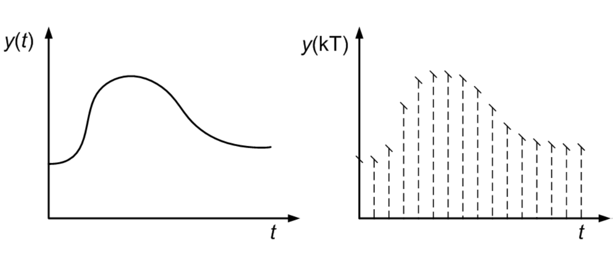

# Projeto da Maratona de Filmes:
## Feito por: Rodrigo Nigri Griner

# Problema:
Você quer passar um final de semana assistindo ao máximo de filmes possível, mas há restrições quanto aos horários disponíveis e ao número de títulos que podem ser vistos em cada categoria (comédia, drama, ação, etc).

Entrada: Um inteiro N representando o número de filmes disponíveis para assistir e N trios de inteiros `(H[i], F[i], C[i])`, representando a hora de início, a hora de fim e a categoria do i-ésimo filme. Além disso, um inteiro M representando o número de categorias e uma lista de M inteiros representando o número máximo de filmes que podem ser assistidos em cada categoria.

Saída: Um inteiro representando o número máximo de filmes que podem ser assistidos de acordo com as restrições de horários e número máximo por categoria.

# Objetivo:
O objetivo do projeto é criar diversos programas fazendo o uso de diferentes heurísticas, para retornar o número máximo de filmes que podem ser assistidos de acordo com as restrições de horários e número máximo por categoria.

# Problema Discreto vs Problema Contínuo:
Se o nosso problema fosse contínuo, seria mais fácil de resolver, pois utilizando cálculo e derivadas, poderíamos encontrar o valor máximo da função objetivo. Porém, como o nosso problema é discreto, não sabemos os vizinhos de um ponto, e por isso, não é possível derivar a função para encontrar o valor máximo. Por isso, utilizaremos heurísticas para tentar encontrar esse valor máximo.



# Implementação das Heurísticas:
## Heurística Gulosa:

### Pseudocódigo:
```
1. Organizar os filmes em um vetor de filmes (struct Filme: HoraInicio, HoraFim, Categoria)
2. Organizar as categorias em um vetor de categorias
3. Organizar os filmes em ordem crescente de HoraFim
4. Inicializar um vetor cronograma de filmes assistidos
5. Inicializar um vetor de categorias assistidas
6. Inicializar um inteiro com o número de filmes assistidos
7. Para cada filme do vetor de filmes:
    verifica se o filme está dentro do horário e se a categoria ainda não ultrapassou o limite
    adiciona o filme no vetor cronograma de filmes assistidos
    acrescenta a categoria no vetor de categorias assistidas
    incrementa o número de filmes assistidos
    atualiza o horário
8. Retorna o número de filmes assistidos
```	


### Resultados:


## Heurística Gulosa Randomizada:

### Pseudocódigo:
``` 
1. Organizar os filmes em um vetor de filmes (struct Filme: HoraInicio, HoraFim, Categoria)
2. Organizar as categorias em um vetor de categorias
3. Organizar os filmes em ordem crescente de HoraFim
4. Inicializar um vetor cronograma de filmes assistidos
5. Inicializar um vetor organizador de horários
6. Inicializar um vetor de categorias assistidas
7. Inicializar um inteiro com o número de filmes assistidos
8. Para cada filme do vetor de filmes:
    verifica se o organizador de horários está disponível
        adiciona o filme no vetor cronograma de filmes assistidos
        acrescenta a categoria no vetor de categorias assistidas
        incrementa o número de filmes assistidos
        altera o organizador de horários
        atualiza o horário
9. Randomiza um número de 0 a 1
10. Se o número for maior que 0.75:
    verifica se o organizador de horários está disponível
        randomiza um número de 0 a [tamanho do vetor de filmes restantes]
        remove o filme do vetor de filmes restantes
        adiciona o filme no vetor cronograma de filmes assistidos
        altera o organizador de horários
11. Retorna o número de filmes assistidos
```

### Resultados: